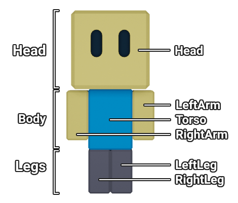

# Costume Specification

A costume is a set of textured meshes that are welded to the character. A costume is composed of 3 sections: Head, Body, and Legs. Each section contains meshes that are welded to specific body parts of the character.

| Costume section | Character body parts |
| --- | --- |
| Head | Head |
| Body | LeftArm, RightArm, Torso |
| Legs | LeftLeg, RightLeg|



Players can mix and match the 3 sections of any costumes they own.

## Variations
A costume can have multiple variations. You will most likely want to reuse some assets for each variation, but you may also create entirely new meshes and textures as well.

If a costume reuses a mesh, you should be cautious of altering its UV map, as we will have to upload it as an entirely new mesh. Try to make your desired texture work with the original UV map first. If it doesn't work, then you are free to alter it.

!!! example
	Crewmate and Patchy are two variations of the Pirate costume. Patchy has a unique head mesh but reuses the body and leg meshes of Crewmate. Both have unique textures.

	

## Eyes
Costumes cannot have their own eye meshes because we will use a separate system for animated facial expressions. You can, however, specify the visibility, scale, and 2D location of each eye.

!!! example
	Crewmate has its left eye hidden and Patchy has both eyes hidden. Also, Crewmate has its right eye shifted down because the pirate hat covers the eye's default position.
## Skin
Humanoid costumes (ex. pirate, chef, miner) have skin exposed. It is important that players be able to customize their skin color. To accomplish this, separate the skin faces of each mesh into their own mesh. Remove any textures from the skin mesh.

**Each body part can only have one skin mesh.** Combine skin meshes if necessary.

!!! tip
	To separate skin faces from a mesh, start by selecting the mesh and going into Edit Mode. Then,

	1. ++3++ to enable Face Select

	2. Select all skin faces

	3. ++p++ to open Separate menu

	4. ++enter++ or ++left-button++ to select "Selection"
## Texturing
We are aiming for a style with a low amount of colors per character. Therefore, textures should only be a few pixels wide and tall. This is not a steadfast rule, however, so do not let it compromise your artistic vision.

!!! example
	Crewmate uses one texture for every mesh.

	

	*(upscaled 50x so you can see the pixels)*

## Pipeline
1. Modeler creates the costume
2. Modeler organizes the file to follow this specification
3. Modeler uploads the file to the drive
4. Programmer downloads the file
5. Programmer records the costume's metadata
6. Programmer imports the unique meshes and textures of the costume
7. Programmer incorporates the metadata, meshes, and textures into the game

## Blend file checklist
This section describes how to format your .blend file. It was designed for minimal typing while guaranteeing no name conflicts.

1. Name the blend file `[Costume]_[Variation]_Costume`. *(ex: Pirate_Patchy_Costume.blend)*
1. Put the unaltered rig in a `Rig` collection. Keep the default body parts that the costume does not override; delete the rest. *(ex: Snorkeler wears a bathing suit that doesn't alter the arms, so they are kept)*
	* Prefix the name of each default body part mesh with `Rig_`. This is to differentiate them from costume meshes.
	* These meshes will not be imported to Roblox but are helpful in previewing the full costume.
1. Put the costume meshes in a `Costume` collection.
	* If only one mesh corresponds to a body part, name it `[BodyPart]`. *(ex: LeftLeg)*
	* If multiple objects correspond to the same body part, put them in a collection named `[BodyPart]`. Name each object in this sub-collection `[BodyPart]_[MeshName]`. *(ex: Head_Eyepatch)*
1. Put skin meshes in a `Skin` collection. Name each `Skin_[BodyPart]`.
	* You can only have one skin mesh per body part.
1. Put the rig's default eyes in an `Eyes` collection. Position and scale them as you please. Delete any unneeded eyes. If no eyes are needed, you do not need the `Eyes` collection.
1. If you reused a mesh from another costume **and did not alter its UV map**, do the following:
	1. Put the mesh inside a `Reused` collection.
	1. Name the mesh `[OriginalCostume]_[OriginalVariation]_[BodyPart]_[MeshName]`.
		1. If the mesh is skin, append `.Skin` to the name.
		1. You do not need the `_[MeshName]` suffix if the original mesh did not have one in its .blend file.
1. Set each mesh's pivot to its corresponding body part’s pivot.

Here's a graphic version of the same information, if that's your style.
??? blender "[Costume]_[Variation]_Costume.blend"

	???+ blender-collection "Scene Collection"
		??? blender-collection "Costume"
			Costume meshes.

			If only one mesh corresponds to a body part, name it `[BodyPart]`. If mutliple meshes correspond to the same body part, put them in a `[BodyPart]` sub-collection. Name each object in this sub-collection `[BodyPart]_[MeshName]`.

			!!! blender-mesh "[BodyPart]"
			!!! blender-collection "[BodyPart]"
				!!! blender-mesh "[BodyPart]_[MeshName]"

		??? blender-collection "Eyes"
			The unaltered rig's eyes.

			Position the eyes on the head as you please. Delete any unneeded eyes. If no eyes are needed, delete this collection.

			!!! blender-mesh "LeftEye"
			!!! blender-mesh "RightEye"

		??? blender-collection "Reused"
			Reused meshes from other costumes **with unaltered UV maps**.

			Name the reused mesh `[OriginalCostume]_[OriginalVariation]_[BodyPart]_[MeshName]`. If the mesh is skin, append `.Skin` to the name. You do not need the `_[MeshName]` if the original mesh did not have it in its .blend file.

			!!! blender-mesh "[OriginalCostume]\_[OriginalVariation]_[BodyPart]"
			!!! blender-mesh "[OriginalCostume]\_[OriginalVariation]_[BodyPart].Skin"
			!!! blender-mesh "[OriginalCostume]\_[OriginalViaration]\_[BodyPart]_[MeshName]"
			!!! blender-mesh "[OriginalCostume]\_[OriginalViaration]\_[BodyPart]_[MeshName].Skin"


		??? blender-collection "Rig"
			The unaltered rig.

			Keep the default body parts that the costume does not override; delete the rest.
			Name each mesh `Rig_[BodyPart]`.
			These meshes will not be imported to Roblox but are helpful for previewing the full costume.

			!!! blender-mesh "Rig_Head"
			!!! blender-mesh "Rig_LeftArm"
			!!! blender-mesh "Rig_LeftLeg"
			!!! blender-mesh "Rig_RightArm"
			!!! blender-mesh "Rig_RightLeg"
			!!! blender-mesh "Rig_Torso"

		??? blender-collection "Skin"
			Skin meshes.

			Name each skin mesh `Skin_[BodyPart]`. You can only have one skin mesh per body part. If there are no skin meshes, delete this collection.

			!!! blender-mesh "Skin_[BodyPart]"

!!! example "Pirate_Crewmate_Costume.blend"
	

## Metadata
The metadata that will be generated for each costume. We will then parse these files in order to generate a tree of folders with attributes and Accessory objects.

```lua
local CostumeData = {
	CostumeName = "CostumeName", -- REQUIRED
	VariationName = "VariationName", -- REQUIRED

	Head = { -- Section
		Head = { -- Body part
			Visible = true,
			Meshes = {
				MeshName = { -- Mesh
					MeshId = "rbxassetid://",
					TextureId = "rbxassetid://",
					Size = Vector3.new(),
					Pivot = CFrame.new()
				}
			},
			SkinMeshId = "rbxassetid://",
			SkinTextureId = "rbxassetid://"
		}
	},

	Body = {
		LeftArm = {...},
		RightArm = {...},
		Torso = {...}
	},

	Legs = {
		LeftLeg = {...},
		RightLeg = {...}
	},

	Eyes = {
		LeftEye = {
			Position = Vector2.new(),
			Scale = Vector3.new(),
			Visible = true
		},
		RightEye = {
			Position = Vector2.new(),
			Scale = Vector3.new(),
			Visible = true
		}
	}
}
```

### Implementation details

* If a body part doesn't have any meshes, then it will fall back to the default mesh
* If "MeshId" is not specified, then the mesh will not apply
* If "Visible" is false, then the body part will be hidden altogether
* If "_EyeVisible" is false, then "_EyePosition" is ignored
* If "_EyePosition" is not specified, then the eye falls back to the default position

## To-do
We aim to automate steps 4-7 of the [Pipeline](#pipeline).

* Automate exporting .blend files
	* Set the mesh positions to their respective body part positions
	* Import the meshes into Roblox
	* Generate a lua file with the metadata above
	* Generate the Accessory objects