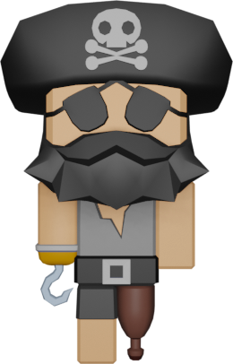
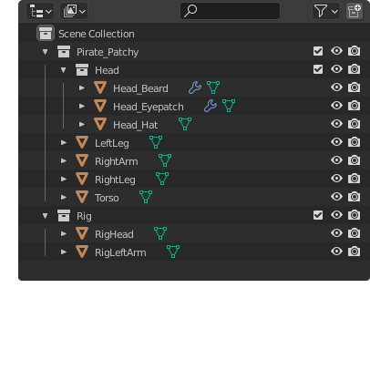
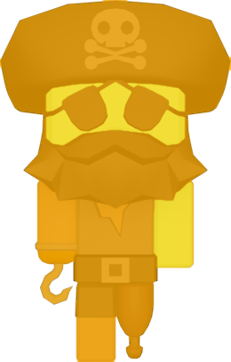
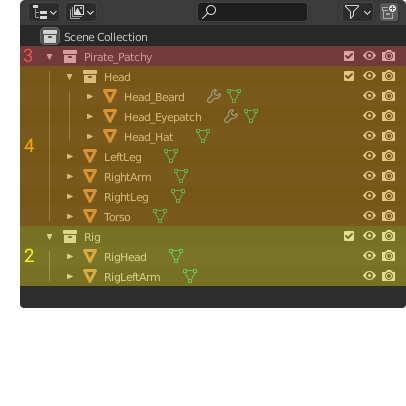

# Costume Specification

A costume is a set of textured meshes that are welded to the character. A costume is composed of 3 sections: Head, Body, and Legs. Each section contains meshes that are welded to specific body parts of the character.

| Costume section | Character body parts |
| --- | --- |
| Head | Head |
| Body | LeftArm, RightArm, Torso |
| Legs | LeftLeg, RightLeg|

Players can mix and match the 3 sections of any costumes they own.

!!! note
	A costume does not need a unique mesh for each body part. Consider the Snorkeler costume whose bathing suit does not cover the arms. In this case, the default arm meshes will be used.

## Variations
A costume can have multiple variations. A variation can be entirely unique or consist of a mix of unique and reused meshes and textures.

!!! example
	Cremate and Patchy are two variations of the Pirate costume. Patchy has a unique head mesh but reuses the body and leg meshes of Crewmate. Crewmate and Patchy both have unique textures.

	

!!! warning
	If a costume reuses a mesh, you should be cautious of altering its UV map -- try to make your desired texture work with the original UV map first. If it doesn't work, then you are free to alter the UV map.
	
	Preserving the original UV map is important because a mesh with an altered UV map must be re-uploaded to Roblox, which takes up extra memory on the client.

## Eyes
Costumes cannot have their own eye meshes because we will use a separate eye system for animated expressions. However, costumes can specify the visibility and 2D location of each eye.

!!! example
	Crewmate has its left eye hidden and Patchy has both eyes hidden. Also, Crewmate has its right eye shifted down because the pirate hat covers the eye in the default position.
## Skin
Humanoid costumes (ex. pirate, chef, miner) have skin exposed. It is important that players be able to customize their skin color. To accomplish this, map the UV islands of skin faces to a transparent pixel. This will allow for the color of the underlying Roblox object to show through, which will be the player's skin color.
## Texturing
In general, we are aiming for a style with a low amount of colors per character. Therefore, textures should only be a few pixels wide and tall. This is not a steadfast rule, however, so do not let it compromise your artistic vision.

## Pipeline
1. Modeler creates the costume
2. Modeler organizes the file to follow this specification
3. Modeler uploads the file to the drive
4. Programmer downloads the file
5. Programmer records the costume's metadata
6. Programmer imports the unique meshes and textures of the costume
7. Programmer incorporates the metadata, meshes, and textures into the game

## Naming requirements
1. Name the blend file `[Costume]_[Variation]_Costume`. *(ex: Pirate_Patchy_Costume.blend)*
1. Put the unaltered rig in a `Rig` collection. Keep the default body parts that the costume does not override; delete the rest. *(ex: Snorkeler wears a bathing suit that doesn't alter the arms, so they are kept)*
	* Prefix the name of each default body part mesh with `Rig`. This is to differentiate them from costume meshes.
	* These meshes will not be imported to Roblox but are helpful in previewing the full costume.
1. Put the costume meshes in a `[Costume]_[Variation]` collection. *(ex: Pirate_Patchy)*
1. For each of the 6 body parts:
	* If only one mesh corresponds to a body part, name it `[BodyPart]`. *(ex: LeftLeg)*
	* If multiple objects correspond to the same body part, put them in a collection named `[BodyPart]`. Name each object in this sub-collection `[BodyPart]_[MeshName]`. *(ex: Head_Eyepatch)*
1. Set each mesh's pivot to its corresponding body part’s pivot.
	* This is necessary. If you stick to the naming conventions, I can write a script to automate this step. Until then, you will have to do it manually.
1. Put the rig's default eyes in an `Eyes` collection under the `[Costume]_[Variation]` collection. Position them on the head as you please. Delete any unneeded eyes. If no eyes are needed, you do not need the `Eyes` collection.

### Example: Pirate_Patchy_Costume.blend

=== "Example"
	

=== "Highlighted"
	

## Metadata
For transparency between modelers and programmers, here is the metadata that will be stored for each costume in-game.

| Category | Variable | Value type | Required |
| --- | --- | --- | :---: |
| | CostumeName | string | ✔️ |
| | VariationName | string | ✔️ |
| Head | | |
| | HeadHidden | boolean |
| | HeadMeshId | rbxassetid |
| | HeadTextureId | rbxassetid |
| Legs | | |
| | LeftLegHidden | boolean |
| | LeftLegMeshId | rbxassetid |
| | LeftLegTextureId | rbxassetid |
| | RightLegHidden | boolean |
| | RightLegMeshId | rbxassetid |
| | RightLegTextureID | rbxassetid |
| Body | | |
| | LeftArmHidden | boolean |
| | LeftArmMeshId | rbxassetid |
| | LeftArmTextureId | rbxassetid |
| | RightArmHidden | boolean |
| | RightArmMeshId | rbxassetid |
| | RightArmTextureId | rbxassetid |
| | TorsoHidden | boolean |
| | TorsoMeshId | rbxassetid |
| | TorsoTextureId | rbxassetid |
| Eyes | | |
| | LeftEyePosition | Vector2 |
| | LeftEyeHidden | boolean |
| | RightEyePosition | Vector2 |
| | RightEyeHidden | boolean |

### Implementation details

* If "_MeshId" is not specified, then the body part will fall back to the default character mesh
* If "_MeshId" is not specified, then "_TextureId" will be ignored
* "_Hidden" will hide a body part altogether
* If "_Hidden" is specified, then "_MeshId" and "_TextureId" are ignored
* If "_EyeHidden" is specified, then "_EyePosition" is ignored
* If "_EyePosition" is not specified, then the eye falls back to the default position